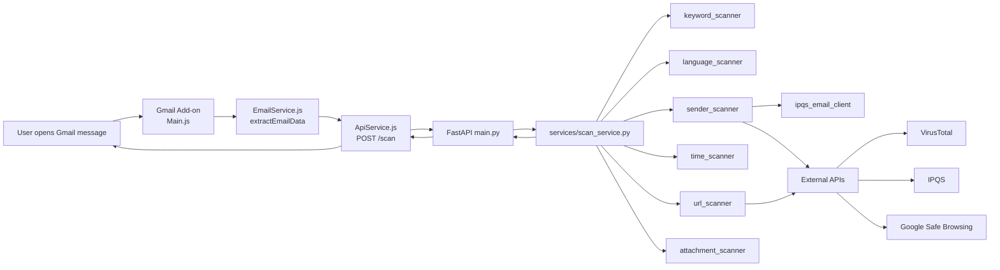
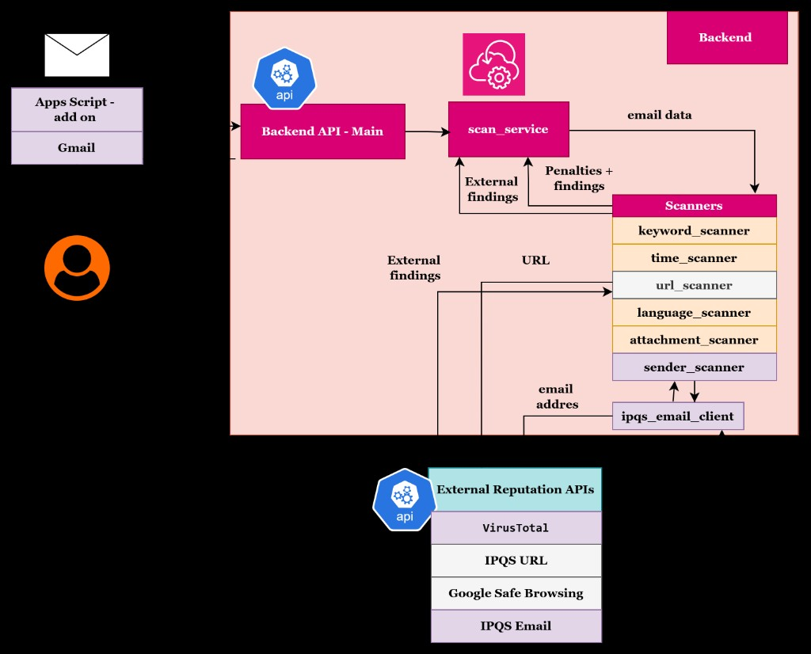

# PhishWall
PhishWall is a Gmail Add-on + FastAPI backend that produces an **explainable maliciousness score** for email content.
It is not a phishing-only yes/no classifier; it combines multiple risk signals and returns a transparent breakdown.

## How to Run

### 1) Backend setup

```bash
cd phishwall_backend
python -m pip install -r requirements.txt
python -m uvicorn main:app --host 0.0.0.0 --port 8000
```

Health check:

```bash
http://localhost:8000/health
```

### 2) Configure environment variables

Create `.env` inside `phishwall_backend` (or copy from `.env.example`) and set keys as needed.

Supported variables:

- `IPQS_API_KEY`
- `GOOGLE_SAFE_BROWSING_API_KEY`
- `VT_API_KEY`

Behavior when keys are missing:

- Local scanner logic still runs and returns a score/verdict.
- External reputation checks are skipped or fallback is used.
- Missing/failed remote lookups are reported as informational findings, not direct risk by themselves.

### 3) Expose backend for Gmail Add-on (typical local workflow)

- Run ngrok on port `8000`.
- Set `API_URL` in `gmail-addon/Config.js` to your public `/scan` URL.

### 4) Apps Script sync (optional for reviewers)

This public submission keeps the `gmail-addon` source files.
Local Apps Script linkage files (such as `.clasp.json`) are intentionally excluded from the public repo for safer publication.

---

## Architecture / High-Level Flow



### Visual diagram

The repository includes `img.png` as a high-level architecture/data-flow diagram.
It is part of the technical documentation and complements the flow above.



---

## Main Features

- FastAPI backend with typed request/response models (`models.py`).
- Event-driven Gmail Add-on UI (Google Apps Script `CardService`), with dynamic card rebuilding.
- Runtime language switching (`he`, `en`, `es`) with RTL/LTR handling.
- Explainable output split into `riskIndicators` vs `infoFindings`.
- Structured `scoreBreakdown` and summary objects (`urlSummary`, `attachmentSummary`, etc.).
- Safe external API fallback behavior when remote providers are unavailable.

---

## External APIs / Services Used

| Service | Used in code | Purpose | Fallback behavior |
|---|---|---|---|
| IPQualityScore Email | `sender_scanner.py` + `ipqs_email_client.py` | Sender email reputation enrichment | If unavailable, local sender checks continue; unavailable state is reported |
| IPQualityScore URL | `url_scanner.py` | URL reputation enrichment | Falls back to Google Safe Browsing |
| Google Safe Browsing | `url_scanner.py` | URL reputation fallback source | If also unavailable, local URL checks continue |
| VirusTotal Domain | `sender_scanner.py` | Sender domain reputation enrichment | If unavailable, local sender checks continue |

---

## Internal Checks / Signals Used

| Signal family | Source | What is checked |
|---|---|---|
| Keywords | `scanners/keyword_scanner.py`, `data/risk_keywords.txt` | Urgency, payment, credential, threat, generic coercive wording |
| Language quality | `scanners/language_scanner.py` | Structural/quality anomalies in text |
| Sender/domain | `scanners/sender_scanner.py` | Sender parse quality, lookalike checks, IPQS email, VirusTotal |
| Lookalike/impersonation | `scanners/lookalike_domain_scanner.py` | Character substitution/extra/missing/swapped character patterns |
| URL checks | `scanners/url_scanner.py` | Malformed URLs, shorteners, `@`, punycode, suspicious TLDs, raw IP host, DNS resolution, remote URL reputation |
| Attachment checks | `scanners/attachment_scanner.py` | Executables/scripts, PDF with embedded links, unknown attachments |
| Time anomaly (supporting only) | `scanners/time_scanner.py` | Off-hours/weekend signal only in BEC/ATO-like context |

---

## Scoring Model

Core logic is implemented in `phishwall_backend/services/scan_service.py`.

### Score composition

1. Start from `score = 100` (higher is safer).
2. Subtract penalties from scanner groups.
3. URL penalties are scaled before final application:
   - `urlApplied = int(urlRaw * 0.7)`
4. Clamp to range `0..100`.
5. Derive:
   - `maliciousScore = 100 - score`
   - `totalPenalty = 100 - score`

### Verdict logic

- `score >= 75` -> `Safe` (green)
- `45 <= score < 75` -> `Suspicious` (yellow)
- `score < 45` -> `High Risk` (red) **only if strong indicators exist**

Strong-indicator gate includes at least one of:

- sender IPQS flagged
- sender VirusTotal flagged
- URL IPQS/GSB flagged
- executable attachment
- PDF with embedded links
- very high keyword pressure (`keyword_penalty >= 28`)

### Scoring Weights at a Glance

Exact values below reflect current code behavior:

- **Very High**
  - Executable/script-like attachment: `+60` each (`attachment_scanner.py`)
  - Confirmed malicious/suspicious remote URL/domain signals can add large penalties (`+30` raw for URL remote hit, `+30` for malicious VT sender domain)
- **High**
  - PDF with embedded links: `+25`
  - URL shortener/malformed URL/`@` in URL/punycode: typically `+20` raw each (then URL scaling applies)
  - Strong lookalike substitution patterns: up to `+16` per detected lookalike pattern
- **Medium**
  - Suspicious TLD: `+12` raw
  - DNS unresolved/raw IP host in URL: around `+15` raw
  - Keyword categories by line weight (`+3` to `+7`) with escalation and category cap (`keyword_penalty` capped at `40`)
- **Low**
  - Base link count penalty: `1..3` total
  - Long URL signal: `+2` raw per hit, capped to first 2 hits
  - Generic non-PDF/non-executable attachment: `+4`
  - Time anomaly support signal: `+1` weekend or `+2` off-hours, only in suspicious context

### Why an email becomes green / yellow / red

- Green: limited penalties and no strong malicious indicators.
- Yellow: moderate accumulated risk or noisy but notable suspicious signals.
- Red: low score **and** concrete strong evidence (not score alone).

---

## Dangerous Attachment Extensions (Implemented)

The backend currently treats the following executable/script-like extensions as dangerous (`EXECUTABLE_EXTENSIONS` in `attachment_scanner.py`):

- `.exe`, `.msi`, `.bat`, `.cmd`, `.ps1`, `.js`, `.jse`
- `.vbs`, `.vbe`, `.wsf`, `.wsh`, `.scr`, `.com`, `.pif`
- `.jar`, `.hta`

Severity behavior:

- Executable/script-like attachments are high severity (`+60` each).
- PDF files are analyzed separately:
  - normal PDF (no links found): informational
  - PDF with embedded/suspicious links: elevated risk (`+25`)

---

## Lookalike / Impersonation Verification

Lookalike checks are fully active and used in scoring:

- Called from both `sender_scanner.py` and `url_scanner.py`.
- Implemented in `lookalike_domain_scanner.py`.
- Patterns include substitution, extra character, missing character, and swapped adjacent characters.

Reference dataset size in current code:

- `78` brand/entity entries
- `160` normalized labels

This means the current list is broad, but it is **not** over 100 brand entities.

---

## Urgency / Pressure Wording Verification

Urgency/threat/payment/account-verification wording affects score through:

- `risk_keywords.txt` weighted entries (urgency/payment/credential/threat/generic)
- escalation rules in `keyword_scanner.py` when risky category combinations co-exist
- BEC/ATO context hints in `time_scanner.py` (supporting signal only)

Severity:

- Keyword impact is medium-to-high depending on matched category mix and escalation.
- Time-based signal remains low by design.

---

## End-to-End Runtime Flow

1. Gmail Add-on trigger opens `buildEmailCard`.
2. `EmailService.js` extracts sender/body/URLs/attachments.
3. `ApiService.js` sends POST to backend `/scan`.
4. FastAPI validates payload with Pydantic models.
5. `scan_service.py` orchestrates scanners and computes score.
6. Add-on renders result card sections:
   - Scan Summary
   - Risk Indicators
   - Score Breakdown
   - Additional Context
   - Decision Explanation
   - Safety Tip

---

## Gmail Add-on UI Behavior (Real implementation)

- Event-driven UI (Apps Script actions/triggers, not React framework runtime).
- Dynamic card rendering through `CardService`.
- Language switch (`switchLanguage`) rebuilds the active card:
  - Home card when no open message context
  - Result card when viewing an email analysis
- Hebrew is rendered RTL, English/Spanish LTR.

---

## Tests

Backend test suite in `phishwall_backend/tests`:

- `test_api.py`
- `test_scan_service.py`

Run:

```bash
cd phishwall_backend
python -m unittest discover -s tests -v
```

---

## Limitations

- Rule-based scoring may still over- or under-score edge-case emails.
- Lookalike coverage is finite and depends on curated local labels.
- External reputation is dependent on provider availability/API quotas.
- Apps Script card UI is constrained by Gmail Add-on component model.

---

## Future Improvements

- Add curated regression fixtures for known false-positive/false-negative samples.
- Add controlled threshold tuning from labeled evaluation sets.
- Add optional caching/rate-limit controls for external reputation calls.
- Expand lookalike dataset coverage incrementally with validated additions.

---

## Submission Notes

Keep in submission:

- `README.md`
- `img.png`
- `gmail-addon/*`
- `phishwall_backend/*` (excluding secrets/caches)
- `.gitignore`
- run scripts

Do not submit:

- real `.env` or any secret-bearing files
- cache/temp artifacts (`__pycache__`, `.pyc`, etc.)
- noisy generated logs

