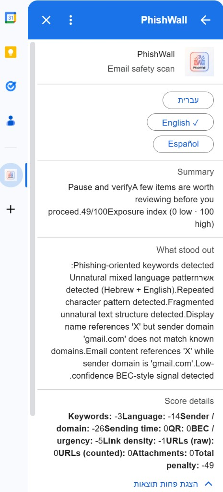

# PhishWall — Gmail Add-on: Malicious Email Scorer

PhishWall is a **Gmail add-on** (Google Apps Script) backed by a **FastAPI** Python service. When the user opens a message, the add-on extracts the relevant fields, sends them to **`POST /scan`**, and renders a card showing a **maliciousness score (`0–100`)**, a **clear verdict**, the **risk indicators that drove it**, a **collapsible numeric breakdown**, and a **practical recommendation** in **English / Hebrew / Spanish**.

> **Reviewer note**: this README is the primary submission document. The files under **[`docs/`](docs/README.md)** are deep-dive supplements (one topic per file) that you only need if you want the implementation specifics.

---

## At a glance

| Component | Where | Purpose |
|-----------|-------|---------|
| **Gmail Add-on** | **`gmail-addon/`** (Apps Script, V8) | Extracts subject, sender, plain body, URLs, attachments, and `sender_prior_thread_count`; renders the result card; localizes UI in EN/HE/ES. |
| **Backend API** | **`phishwall_backend/`** (FastAPI) | Receives the JSON, runs a multi-phase **scanner pipeline**, and returns a structured `ScanResponse` with score, verdict, reasoning, breakdown. |
| **Documentation** | **`docs/`** | Topic-specific Markdown: API contract, scoring & verdict, architecture, latency/resilience, design, getting started, Gmail add-on detail, submission checklist. |

```text
Gmail user → Gmail Add-on (Apps Script) → POST /scan → FastAPI → ScannerPipeline → ScanResponse → Cards (UiService.js)
```

---

## What the user sees

The add-on card shows, per language:

- **Status headline** (`Low exposure` / `Pause and verify` / `High risk`).
- **Short summary sentence** that matches the verdict.
- **Exposure index** (`0` low · `100` high).
- **What stood out** — concrete risk indicators (sender spoofing, suspicious URL, executable attachment, QR phishing, BEC).
- **Notes from scan** — informational findings (e.g. `IPQS lookup timed out; fell back to local rules`).
- **Score details** — collapsible numeric breakdown (`keywords`, `sender`, `urlRaw`/`urlApplied`, `attachments`, `qr`, `priorityThreats`, `totalPenalty`).
- **More detail** — rationale, recommendation, main reasons.
- **Quick tip** — short safety reminder.

Minimal, neutral typography. The headline visual is the score itself — bold and color-coded (`green` / `amber` / `red`) per verdict. No decorative status circles or colored hero block. Copy and rendering live in `gmail-addon/UiService.js`.

### Screenshot

Live add-on rendering on a sample message (English UI; the in-card switcher toggles to **`עברית`** and **`Español`**):



> Currently only one screenshot ships in this repo. The same flow renders in Hebrew (RTL) and Spanish through the in-card language buttons. To capture HE/ES variants, switch the language inside the add-on and screenshot the result panel.

---

## Run it locally — the single official setup flow

There is **one** entry point to set up and start the backend:

| OS | Command (from repo root) |
|----|--------------------------|
| **Windows** | `setup.bat` *(or)* `powershell -ExecutionPolicy Bypass -File .\setup.ps1` |
| **macOS / Linux** | `chmod +x setup.sh && ./setup.sh` |

What the script does automatically (idempotent — safe to re-run):

1. Verifies Python ≥ 3.10.
2. `cd`s into **`phishwall_backend/`** (where `main.py` lives — uvicorn must run from here).
3. Creates **`phishwall_backend/.venv`** and activates it for this session.
4. Installs **`requirements.txt`**.
5. Copies **`.env.example`** to **`.env`** if missing (no secrets pre-filled).
6. Prints the manual steps that **cannot** be automated (see below).
7. Starts FastAPI on `http://0.0.0.0:8000` (use `-NoStart` / `--no-start` to skip).

Verify the backend is alive (in another terminal):

```powershell
Invoke-RestMethod http://127.0.0.1:8000/health   # -> {"status":"ok"}
```

### What is NOT one-click (and why)

These three things are **per-reviewer** and live outside this repository, so the script prints them as next steps rather than performing them:

| Manual step | Why it cannot be automated |
|-------------|----------------------------|
| **`ngrok` install + `ngrok config add-authtoken …`** + **`ngrok http 8000`** in a second terminal. | ngrok needs **your** account token; free hostnames also change between sessions. |
| **`gmail-addon/Config.js`** → set `const API_URL = "https://<your-ngrok-host>/scan"`. | The HTTPS URL only exists once you start your own ngrok tunnel (step 1). |
| **`clasp login`** + **`clasp push`** from the repo root (run **`clasp create`** first if `.clasp.json`’s `scriptId` is not yours). | The Gmail add-on must be deployed under **your** Google account / Apps Script project. |

A truly one-click setup is **not realistic** for this assignment because Gmail add-ons live in Google’s Apps Script cloud and require account-level OAuth that the repo cannot perform on the reviewer’s behalf.

> **The full annotated walkthrough** (prerequisites, per-step verification, macOS/Linux equivalents, troubleshooting matrix) is in **[`docs/getting-started.md`](docs/getting-started.md)**.

---

## Tests

From `phishwall_backend/`:

```powershell
python -m unittest discover -s tests -v
```

Covers API smoke (`tests/test_api.py`), scoring & verdict logic, scanners, **`tests/test_parallel_execution.py`** (asserts wall-clock behavior of phased parallelism). Last verified: **25 tests, OK**.

---

## Architecture, in one minute

- **Why split add-on and backend?** The Apps Script runtime is constrained for heavyweight parsing (URL reputation, QR decoding, large attachments). Heavy logic stays in **Python**; the add-on is a thin client. The contract is **stable JSON** (`docs/api-contract.md`).
- **Why a phased scanner pipeline?** Some checks are independent (`keywords`, `language`, `sender`, `time`) and run concurrently. Others (`priority_threats`/BEC) need the outputs from phase 1, so they are deliberately serialized. URL/attachment/QR run together in phase 3. This is enforced in `services/scanner_pipeline.py`. See **[`docs/architecture.md`](docs/architecture.md)** and **[`docs/latency-and-resilience.md`](docs/latency-and-resilience.md)**.
- **Why a separate verdict engine?** The numeric `maliciousScore` is one input. The final verdict policy (categorical strong-signal rules, mailbox familiarity moderation) lives in `services/verdict_engine.py` so reviewers can audit policy without re-reading scoring. See **[`docs/scoring-and-verdict.md`](docs/scoring-and-verdict.md)**.
- **Why optional reputation services?** **IPQS / VirusTotal / Google Safe Browsing** sharpen results, but the API key is your responsibility. The system **always returns the same response shape** when keys are missing, when the lookup times out, or when a single scanner stage raises — degraded but not broken. Caps and timeouts are tunable via **`PHISHWALL_*`** env vars (defaults in `scanners/external_http_config.py`).

---

## Security posture

PhishWall treats the email as **untrusted input**, top to bottom:

- **Pydantic models** (`models.py`) enforce hard caps: `subject ≤ 300`, `body ≤ 200K`, `urls ≤ 300`, `attachments ≤ 100` items, **2 MB Base64** per attachment, etc.
- **No execution** of attachments — the QR scanner uses headless OpenCV in pure decode mode; URL fetches go through urllib with a hard timeout (`PHISHWALL_QR_FETCH_TIMEOUT`, default 4 s).
- **Bounded outbound HTTP** (per-service timeouts) so a slow/dead third party cannot stall a `/scan` call.
- **Per-stage isolation**: an exception in one scanner is logged and contributes an `infoFindings` line — it does not crash the whole scan.
- **Secrets stay out of git**: `.env` is in `.gitignore`. Apps Script `Config.js` ships with the **`YOUR_PUBLIC_HOST_HERE`** placeholder. The committed `phishwall_backend/.env.example` shows variable names only.
- **Mailbox familiarity is a moderation signal, not a whitelist**: prior-thread count from `GmailApp.search` only softens borderline verdicts; it cannot override `executable attachment` / strong reputation flags. See `services/verdict_engine.py`.

---

## Documentation map

The deep-dive files live under **[`docs/`](docs/)**; each owns exactly one topic, no overlap with this README.

| Document | Topic |
|----------|-------|
| **[`docs/getting-started.md`](docs/getting-started.md)** | Full setup, two-terminal runbook, `clasp` flow, troubleshooting. |
| **[`docs/architecture.md`](docs/architecture.md)** | End-to-end flow, pipeline phases, system diagram. |
| **[`docs/api-contract.md`](docs/api-contract.md)** | Canonical `GET /health`, `POST /scan` JSON. |
| **[`docs/scoring-and-verdict.md`](docs/scoring-and-verdict.md)** | Penalties, breakdown, verdict rules, mailbox familiarity. |
| **[`docs/latency-and-resilience.md`](docs/latency-and-resilience.md)** | Parallel phases, timeouts, fallbacks, validation tests. |
| **[`docs/gmail-addon.md`](docs/gmail-addon.md)** | Client-side flow, file-by-file, `API_URL`. |
| **[`docs/design.md`](docs/design.md)** | Threat focus, design trade-offs, limitations. |
| **[`docs/submission-checklist.md`](docs/submission-checklist.md)** | What ships, what does not, smoke tests. |


---

## Submission notes for reviewers

- **`.clasp.json`** in this repo points at the author’s Apps Script project. To install in **your** Google account, run `clasp create` (or replace `scriptId`), then `clasp push` and deploy as a Gmail add-on.
- **`gmail-addon/Config.js`** intentionally ships with `https://YOUR_PUBLIC_HOST_HERE/scan`. Replace it with your own HTTPS tunnel before `clasp push`.
- The optional API keys (IPQS, VT, Safe Browsing) are **not required** to run a demo: the backend returns the same response shape and just records that those lookups were skipped/disabled in `infoFindings`.
- Designed and validated on **Python 3.13**, FastAPI, Apps Script V8.

---

## Repository layout

```text
phishwall_public_/
├── README.md                       ← you are here
├── docs/                           ← topic-specific documentation
├── gmail-addon/                    ← Apps Script (clasp rootDir)
├── phishwall_backend/              ← FastAPI service + scanners + tests
├── setup.ps1 / setup.bat / setup.sh   ← single official setup + run entry point
├── system_img.png                  ← architecture image used in docs/architecture.md
├── docs/screenshots/addon_en.png   ← UI screenshot referenced from this README
├── .clasp.json
└── .gitignore
```
