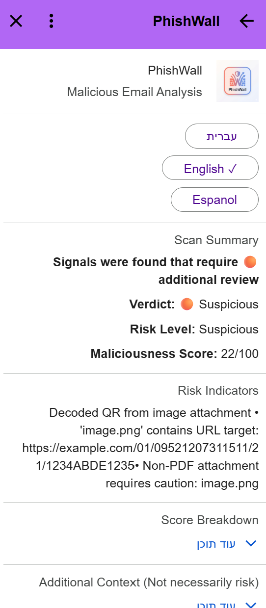
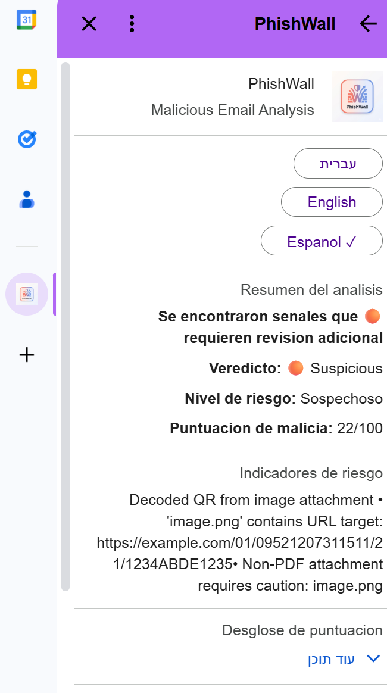
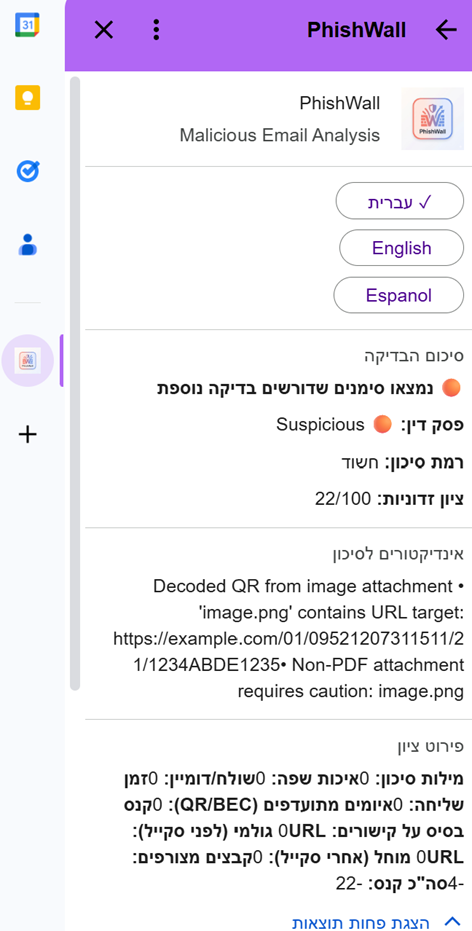
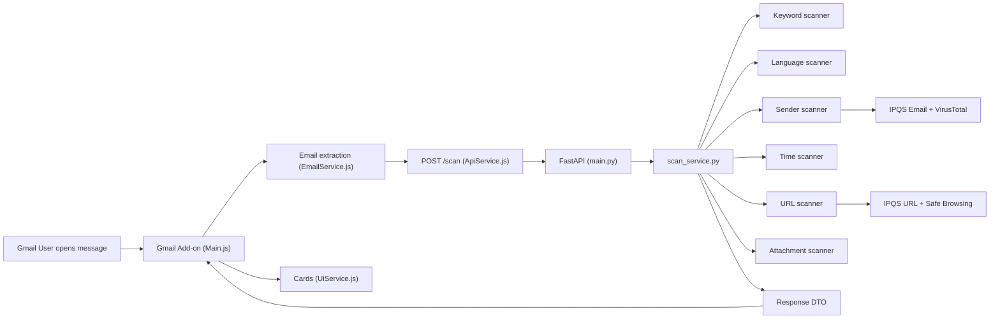

# PhishWall

PhishWall is a **Gmail add-on** (Google Apps Script) backed by a **FastAPI** service. It analyzes the open message, calls **`POST /scan`**, and—**in English, Spanish, or Hebrew**—presents a **Maliciousness Score** on **0–100** where **higher = more malicious** (as in the screenshots and `UiService.js`), together with **Verdict** (`Safe` / `Suspicious` / `Dangerous / Do Not Open`), **Risk Level** (aligned with the verdict band), reasoning, **Risk Indicators**, **Additional Context** (`infoFindings`), and **Score Breakdown**.

---

## What it does

- Runs in Gmail on a selected message; extracts headers, body, URLs, and attachments (**including inline images**) via `EmailService.js`.
- Calls the backend **`/scan`** with that payload (`ApiService.js`).
- Renders **CardService** UI: prominent **Maliciousness Score**, **Verdict**, **Risk Level**, breakdown panels, localized tips—the language is chosen via the in-card switcher (see screenshots below).

---

## UI examples

<table align="center">
  <tr>
    <td align="center"><b>English</b></td>
    <td align="center"><b>Español</b></td>
    <td align="center"><b>Hebrew</b></td>
  </tr>
  <tr>
    <td></td>
    <td></td>
    <td></td>
  </tr>
</table>

---

## Threat focus (design rationale)

I reviewed recent public reporting to decide what PhishWall should emphasize. The consistent theme is that **phishing remains central**, with heightened attention to **QR-based delivery** and **BEC-style** abuse. The implementation therefore foregrounds those patterns alongside **sender impersonation**, **suspicious URLs**, and **dangerous attachments**.

Sources: [Israel National Cyber Directorate annual report](https://www.gov.il/en/pages/2025report), [Microsoft Threat Intelligence – Email threat landscape Q1 2026](https://www.microsoft.com/en-us/security/blog/2026/04/30/email-threat-landscape-q1-2026-trends-and-insights/).

**From categories to the Maliciousness Score.** Scoring is **additive and rule-based**: each scanner adds non-negative **penalties** into named buckets (`scoreBreakdown`). The pipeline **sums** selected buckets into **`totalPenalty`** (`services/scanner_pipeline.py`), then `scan_service.py` sets **`score = clamp(100 − totalPenalty)`** and **`maliciousScore = 100 − score`**. So anything that increases penalties **increases** the user-facing **Maliciousness Score**. There is no learned model—only the **fixed integers** defined in each scanner (plus the explicit **0.7** multiplier on URL penalties before they enter the sum). **Verdict** is a separate layer: `verdict_engine.py` applies threshold and “strong indicator” rules on top of `maliciousScore` (detailed under [Scoring and verdict](#scoring-and-verdict)).

The table ties **research priorities** to **what runs in code**, how it contributes to **`totalPenalty`**, and how strong that contribution tends to be (based on caps and dampening already in code—not a subjective ranking).

| Priority | What the code evaluates | Implemented in | Influence on **`maliciousScore`** |
|----------|---------------------------|----------------|-------------------------------------|
| **QR / “quishing”** | Finds QR payloads in images (attachment/inline **`contentBase64`**); optionally follows QR-looking links, fetches a small amount of content, tries decode | `scanners/qr_scanner.py`, `QrScannerAdapter` in `services/scanner_pipeline.py` | Adds bucket **`qr`**. Effect is **meaningful but bounded**: totals are capped **per attachment path** and **per linked-fetch path**, then combined, so repeats do not explode the score. Decoded payloads also strengthen **verdict** logic when URLs appear. |
| **BEC / priority framing** | Financial/pressure language in subject/body, combined with spoofing/context hints from earlier pipeline state | `data/priority_threat_keywords.json`, `PriorityThreatScannerAdapter` | Adds bucket **`priorityThreats`** (**`+16`** when several BEC-aligned signals agree, **`+5`** for a single weak signal). **Medium uplift** relative to headline attachment/sender spikes. Also feeds BEC-related **verdict** flags. |
| **Sender & brand trust** | Display-name vs domain, brand references vs actual host, punycode domains, local look-alike heuristics, optional IPQS/VirusTotal | `sender_scanner.py`, `lookalike_domain_scanner.py`, `data/impersonation_targets.json`, `ipqs_email_client.py` | Adds bucket **`sender`**. Often **among the heavier numeric buckets** when reputation APIs fire or spoofing cues stack (fixed per-rule integers; VT/IPQS deltas composed with explicit **`0.7` / `0.6`** weighting inside `sender_scanner.py`). |
| **Links & URL reputation** | URL shape issues (shorteners, punycode, suspicious TLD hints, malformed patterns, etc.); optional IPQS + Safe Browsing | `url_scanner.py` | Fills **`urlRaw`** / **`urlApplied`**. **Only `urlApplied` (= `⌊urlRaw × 0.7⌋`) enters `totalPenalty`**, so URLs can register large raw totals but contribute **less** than their face value toward the summed score—a deliberate trade-off vs. spoofing/files. |
| **Attachments & payloads** | Executables/double-extensions/RTL tricks, risky archives, PDFs with extracted URLs inside the file | `attachment_scanner.py` | Adds bucket **`attachments`**. **Single findings can dominate** (e.g. executable **`+60`**, disguised filename **`+35`**) relative to lighter buckets. Executable/disguised patterns also act as **verdict strong indicators**. |
| **Coercion language & text quality** | Phishing lexicon with per-term weights + combination escalation; simple “low-quality template” heuristics (mixed scripts, punctuation, fragments) | `keyword_scanner.py` + `data/risk_keywords.txt`, `language_scanner.py` | Adds buckets **`keywords`** (hard cap **40**) and **`language`** (cap **15**). **Medium / supporting**: raises pressure without letting language alone swamp structural signals. Keyword penalty magnitude also gates some **verdict** urgency checks. |
| **Context nudges** | Unusual send time only when body already looks BEC/ATO-like; small extra cost when many links are present | `time_scanner.py`, `LinkBaseScannerAdapter` | Adds **`time`** (at most **2** in those contexts) and **`linkBase`** (cap **3**). **Supporting only**—confirms suspicious narratives rather than driving the score alone. |

**Takeaway for reviewers:** PhishWall does **not** ship a separate weighting matrix beyond the per-rule integers, the **URL × 0.7** dampener, and the **QR/keyword/language caps** above. What feels “prioritized” in the product sense (QR, BEC, impersonation) shows up as **dedicated pipeline stages**, **larger typical penalty spikes** for certain attachment/sender findings, and **additional verdict rules**—not as a second hidden scoring engine.

---

## Architecture and scanner pipeline

**Client → server.** `Main.js` → `EmailService.js` → `ApiService.js` → `main.py` → `services/scan_service.py`.



The diagram simplifies the backend: **QR** runs inside the pipeline (`scanner_pipeline.py` → `qr_scanner.py`) but is omitted above for readability.

**Pipeline behavior.** Adapters in `services/scanner_pipeline.py` accumulate penalties and narratives; **`verdict_engine.py`** applies policy on top of the numeric result.

**Execution order:** keywords → language → sender → time → **QR** (attachments/inline images and QR-linked URLs) → priority threats (BEC) → link-density nudge → URL → attachments → totals → verdict.

---

## Design decisions and trade-offs

| Decision | Rationale |
|----------|-----------|
| **Rule-first core** | Predictable behavior and straightforward unit tests without mandatory third parties. |
| **Optional reputation** | IPQS (email/URL), VirusTotal (domain), Google Safe Browsing (URL fallback) deepen signals when keys exist; outages or missing keys still yield a complete scan. |
| **URL penalty dampening** | Only **`urlApplied = int(urlRaw × 0.7)`** enters **`totalPenalty`**, reducing single-link noise vs. spoofing or file-based risks. |
| **Verdict ≠ raw score rank** | `verdict_engine.py` combines **`maliciousScore`** with categorical “strong indicators” (executables, spoofing cues, flagged reputation, QR/BEC signals, urgent-keyword thresholds). |
| **Local backend + tunnel** | Default submission path: run FastAPI locally, expose with ngrok (or similar), point `gmail-addon/Config.js` at **`…/scan`**. Same **`/scan`** contract supports a hosted URL later—swap config and redeploy only. |

---

## Project structure

```text
phishwall_public_/
├── README.md
├── add_on_EN.png / add_on_es.png / add_on_img.png
├── run_dev.ps1 / run_dev.bat
├── .clasp.json               # Apps Script rootDir: gmail-addon
├── gmail-addon/              # Main, EmailService, ApiService, UiService, Config, appsscript.json
└── phishwall_backend/
    ├── main.py, models.py, requirements.txt
    ├── .env.example
    ├── data/                 # risk_keywords.txt, priority_threat_keywords.json, impersonation_targets.json
    ├── scanners/, services/, tests/
```

---

## Run locally

1. **Python deps:** `cd phishwall_backend` → `python -m pip install -r requirements.txt`
2. **Secrets:** copy **`phishwall_backend/.env.example`** → **`phishwall_backend/.env`**. Use `KEY=value` (no spaces around `=`). Optional: `IPQS_API_KEY`, `GOOGLE_SAFE_BROWSING_API_KEY`, `VT_API_KEY`.
3. **API:** from `phishwall_backend`:

   ```bash
   python -m uvicorn main:app --host 0.0.0.0 --port 8000
   ```

   Health: `http://localhost:8000/health`
4. **Public URL:** `ngrok http 8000` (or equivalent). Set **`gmail-addon/Config.js`** → `API_URL = "https://<host>/scan"`.
5. **Add-on:** from repo root, `clasp push` (Windows: `clasp.cmd push`). In Apps Script: **Deploy → Manage deployments**; refresh Gmail.

**Common issues:** port `8000` already bound (stop the conflicting process); ngrok **502** usually means nothing is listening on `localhost:8000`.

**API input:** Request body is validated with Pydantic; unknown fields are ignored (`ScanRequest.extra = "ignore"`).

---

## External services (optional)

| Service | Code | Role |
|---------|------|------|
| IPQS Email | `ipqs_email_client.py`, `sender_scanner.py` | Sender/email reputation enrichment |
| VirusTotal | `sender_scanner.py` | Domain reputation |
| IPQS URL | `url_scanner.py` | URL reputation |
| Google Safe Browsing | `url_scanner.py` | URL reputation fallback |

---

## Scoring and verdict

**Total penalty** (`scanner_pipeline.py`) sums: **`keywords`**, **`language`**, **`sender`**, **`time`**, **`qr`**, **`priorityThreats`**, **`linkBase`**, **`urlApplied`**, **`attachments`**. Then **`score = clamp(100 − totalPenalty)`** (`scan_service.py`). The response’s **`maliciousScore`** (**`100 − score`**) drives the **Maliciousness Score** line in Gmail. **`urlRaw`** is reported for transparency but **not** added into the total—only **`urlApplied`**.

**Relative weight (scan quickly):**

| Bucket | Role | Notes (code) |
|--------|------|----------------|
| Attachments | Largest single spikes | e.g. executable **`+60`**, disguised name **`+35`**, PDF-with-links **`+25`**, risky archive **`+12`** (`attachment_scanner.py`) |
| Sender | Strong structural signal | VT domain hits, display-name/brand mismatch, punycode; IPQS vs look-alike blend **`IPQS×0.7 + look-alike×0.6`** (`sender_scanner.py`) |
| URLs | High raw, softened in total | **`~70%`** of URL raw penalty applies (`UrlScannerAdapter`) |
| Keywords | Capped language pressure | **`risk_keywords.txt`**, escalation, cap **`40`** (`keyword_scanner.py`) |
| QR | Strong, bounded | Attachment branch capped **`36`**, linked-fetch branch **`42`**, then combined in **`qr`** (`qr_scanner.py`) |
| BEC / priority | Medium layer | **`+16`** multi-signal / **`+5`** weak single (`PriorityThreatScannerAdapter`) |
| Language / time / links | Light nudges | Language cap **`15`**; time **`≤2`** and only under BEC/ATO-like context (`time_scanner.py`); link-base cap **`3`** |

**Verdict** merges **`maliciousScore`** with policy rules in **`verdict_engine.py`**—not the breakdown table alone.

---

## Limitations

Heuristic rules and curated lists cannot cover every campaign; reputation APIs carry quotas and latency. Gmail **CardService** limits layout richness compared with a full web app.

---

## Tests

```bash
cd phishwall_backend
python -m unittest discover -s tests -v
```

---

## Submission checklist

**Include:** `README.md`; UI screenshots **`add_on_EN.png`**, **`add_on_es.png`**, **`add_on_img.png`**; **`gmail-addon/`**; **`phishwall_backend/`** (no secrets); helper scripts (`run_dev.*`); **`.gitignore`**.

**Exclude:** real `.env` files, `__pycache__/`, ephemeral logs.
