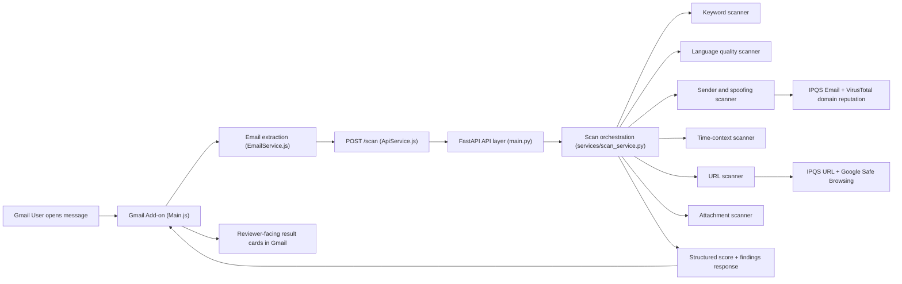

# PhishWall

PhishWall is a Gmail Add-on with a FastAPI backend that returns an **explainable malicious email score**.
The system is intentionally broader than phishing-only detection: it combines phishing, spoofing, and malware-delivery signals into one transparent result.

---

## What This System Does

- Analyzes a Gmail message in near real-time when opened in the Add-on.
- Computes a numeric score (`0..100` safety scale) and verdict (`Safe`, `Suspicious`, `Dangerous / Do Not Open`).
- Returns explainable evidence:
  - `riskIndicators` (high-signal suspicious findings)
  - `infoFindings` (context/fallback information)
  - `scoreBreakdown` + summaries for sender, URLs, attachments, language, and time.
- Uses both local heuristics and optional external reputation providers (with safe fallback when keys are missing).

---

## Architecture and Main Data Flow



`img.png` is also included as an additional visual reference.

---

## Scanner Layer Design Pattern (Implemented)

The scanner layer now uses a **Pipeline/Aggregator pattern with Strategy-style scanner adapters**.

Why this pattern was chosen for this project:
- The system runs multiple independent scanners in a fixed sequence.
- Some scanners are optional by context (for example URL and attachment scanners).
- The backend needs centralized aggregation of findings, scoring breakdown, summaries, and verdict inputs.

Why it fits better than alternatives:
- Better than pure Strategy alone: Strategy helps per-scanner behavior, but does not by itself handle orchestration + aggregation.
- Better than Template Method here: scanner logic is heterogeneous and function-based, so inheritance-heavy templates add complexity without clear gain.
- Pipeline/Aggregator keeps scanner execution explicit and maintainable while preserving current scoring behavior.

Current mapping in code:
- `phishwall_backend/scanners/base.py`
  - `ScanContext`: normalized scan input context
  - `ScannerResult`: standardized scanner output contract
- `phishwall_backend/services/scanner_pipeline.py`
  - scanner adapters around existing scanner functions
  - ordered execution pipeline
  - optional scanner gating (`applies`)
  - centralized aggregation into `riskIndicators`, `infoFindings`, score breakdown, and summaries
- `phishwall_backend/scanners/qr_scanner.py`
  - dedicated QR decoding from image attachments (decoded from base64 bytes)
  - QR payload scoring and QR-specific findings generation
- `phishwall_backend/services/verdict_engine.py`
  - final verdict/reasoning/recommendation policy from aggregated signals
- `phishwall_backend/services/scan_service.py`
  - thin orchestration facade: build context -> run pipeline -> run verdict engine -> return response DTO

Scanner execution flow:
1. Build `ScanContext` from incoming payload.
2. Run scanner adapters in configured order:
   - keywords -> language -> sender -> time -> QR decode (attachments + QR-linked resources) -> priority threats (BEC) -> link base -> URL -> attachments
3. Aggregate penalties/findings/summaries centrally.
4. Compute `score` / `maliciousScore`.
5. Compute final `verdict`, `verdictReasoning`, and `recommendation` in `verdict_engine`.

Responsibilities separated by refactor:
- **Scanner adapters**: detection logic bridging existing scanners to a common contract.
- **Pipeline**: execution order, optional execution, normalization, aggregation.
- **Verdict engine**: user-facing decision policy.
- **Service facade**: API-facing response composition.

---

## Project Structure

```text
phishwall_public_/
├── README.md
├── .env.example
├── run_dev.ps1
├── run_dev.bat
├── gmail-addon/
│   ├── Main.js
│   ├── EmailService.js
│   ├── ApiService.js
│   ├── UiService.js
│   ├── Config.js
│   └── appsscript.json
└── phishwall_backend/
    ├── main.py
    ├── models.py
    ├── requirements.txt
    ├── data/risk_keywords.txt
    ├── data/priority_threat_keywords.json
    ├── data/impersonation_targets.json
    ├── scanners/
    │   ├── base.py
    │   └── qr_scanner.py
    ├── services/
    │   ├── scanner_pipeline.py
    │   └── verdict_engine.py
    └── tests/
```

---

## Step-by-Step: Run the Project (Assignment Path)

### 1) Backend dependencies

```bash
cd phishwall_backend
python -m pip install -r requirements.txt
```

### 2) Environment configuration

Create `phishwall_backend/.env` (or copy `phishwall_backend/.env.example`).

Use strict dotenv format (`KEY=value`), with no spaces around `=`.
Example:

```bash
IPQS_API_KEY=your_ipqs_key_here
GOOGLE_SAFE_BROWSING_API_KEY=
VT_API_KEY=
```

Supported optional keys:
- `IPQS_API_KEY` (email + URL reputation)
- `GOOGLE_SAFE_BROWSING_API_KEY` (URL fallback reputation)
- `VT_API_KEY` (sender-domain reputation)

Without keys, local logic still runs and returns a valid score; remote reputation findings are reported as informational fallback context.

### 3) Start backend

```bash
cd C:\Users\ronyz\OneDrive\Desktop\phishwall_public_\phishwall_backend
python -m uvicorn main:app --host 0.0.0.0 --port 8000
```

Quick check:

```bash
http://localhost:8000/health
```

### 4) Expose local backend for Gmail Add-on via ngrok

```bash
ngrok http 8000
```

Expected healthy startup logs before opening Gmail:
- `Startup: IPQS_API_KEY loaded=True` (or `False` if key is intentionally empty)
- `Application startup complete.`
- `Uvicorn running on http://0.0.0.0:8000`

Set the Add-on backend endpoint in `gmail-addon/Config.js`:
- `API_URL = "https://dispense-why-glamour.ngrok-free.dev/scan"` (current active tunnel)
- If you rotate tunnel/domain later, update this exact value to `https://<your-ngrok-domain>/scan`.

### 5) Sync Add-on code to Apps Script and deploy

- If you work with `clasp`, run `clasp.cmd push` on Windows (or `clasp push` on macOS/Linux) from this repo root.
- This repository is configured for Apps Script sync via `.clasp.json` with `rootDir: "gmail-addon"`.
- In Apps Script, open **Deploy -> Manage deployments** and update (or create) the Gmail Add-on deployment.
- In Gmail, refresh and test the Add-on on a real message.

### Runtime troubleshooting (Windows)

- `Uvicorn [Errno 10048]`: port `8000` is already occupied by another process.
- Find the owning process:
  - `Get-NetTCPConnection -LocalPort 8000 | Where-Object { $_.State -eq 'Listen' } | Select-Object State,OwningProcess`
  - `Get-Process -Id <PID> | Select-Object Id,ProcessName,Path`
- Stop it:
  - `Stop-Process -Id <PID> -Force`
- `ngrok 502 Bad Gateway` means ngrok is up but cannot reach a healthy backend on `localhost:8000`.
- Start backend from the correct folder:
  - `cd phishwall_backend`
  - `python -m uvicorn main:app --host 0.0.0.0 --port 8000`

---

## Design Decisions and Why

### Local heuristics as the default decision engine
- The core scanning path is rule-based and always available (keywords, language, sender, URL, attachment, QR, and BEC signals).
- This keeps behavior deterministic and testable even when external providers are unavailable.

### External reputation as additive enrichment
- External checks are integrated as enrichment, not as a hard dependency.
- Current implementation:
  - **IPQualityScore Email**: `phishwall_backend/scanners/ipqs_email_client.py` (used by `sender_scanner.py`)
  - **VirusTotal Domain**: `phishwall_backend/scanners/sender_scanner.py`
  - **IPQualityScore URL**: `phishwall_backend/scanners/url_scanner.py`
  - **Google Safe Browsing** (fallback): `phishwall_backend/scanners/url_scanner.py`
- If keys are missing, out of credits, or provider calls fail, the system falls back to local findings and still returns a complete result.

### Deployment approach for this project: local backend + ngrok
- The project uses a local FastAPI runtime exposed through ngrok for practical iteration speed and low operational overhead.
- This setup keeps development and demo feedback loops short (code change -> restart -> immediate real Gmail validation).
- It can later be replaced with an external hosted backend without changing the add-on architecture (only endpoint/runtime configuration changes are needed).

---

## Preliminary Research and Threat Landscape Rationale

This project prioritizes two attack patterns that are currently common and highly relevant in real email abuse:

- **QR phishing (quishing)**: attackers move users from email to QR-based phishing pages, often bypassing traditional link scrutiny behavior.
- **BEC (Business Email Compromise) / impersonation**: financially motivated social engineering that often relies on urgency, authority spoofing, and low-link text-based manipulation.

Why these were prioritized:
- They are frequent in practical enterprise and consumer email threat reports.
- They can create high-impact outcomes (credential theft, payment fraud) even when classic phishing patterns are partially absent.

How research influenced the implementation chain:
- **Research** -> prioritize QR phishing + BEC
- **Prioritized threats** -> add dedicated detection logic
- **Detection logic** -> contribute explicit penalty signals
- **Score** -> increases maliciousness score through threat-specific penalties
- **Verdict** -> strict escalation rules can force `Dangerous / Do Not Open`
- **Recommendation** -> user gets direct action guidance based on verdict severity

---

## Threat Vocabulary and Target Catalog Storage

To keep threat logic maintainable, prioritized vocabularies and impersonation targets are stored in data files:

- `phishwall_backend/data/priority_threat_keywords.json`
  - contains BEC finance terms and BEC pressure terms
  - used by `services/scanner_pipeline.py` (priority threat scanner stage) for BEC scoring
- `phishwall_backend/data/impersonation_targets.json`
  - contains curated known-brand targets with `name`, `labels`, and `domains`
  - used by `scanners/lookalike_domain_scanner.py` for brand/domain matching and look-alike checks

Matching behavior:
- case-insensitive normalization for text, labels, and domains
- label normalization removes hyphens for robust matching (`bank-leumi` -> `bankleumi`)
- typo-squatting/look-alike checks include substitution, extra character, missing character, and swapped adjacent characters

---

## Current Security Coverage (Implemented)

### Sender, spoofing, and impersonation
- Look-alike domain detection (substitution, extra/missing/swap patterns).
- Display-name brand vs sender-domain mismatch detection.
- Subject/body brand mention vs sender-domain mismatch detection.
- Curated Israeli + global brand mapping (`BRANDS`, `LABEL_TO_BRAND`, `BRAND_PRIMARY_DOMAINS`).
- BEC-oriented impersonation signal integration into verdict escalation.

### URL risk signals
- Malformed URLs, shorteners, `@` usage, punycode, suspicious TLDs.
- Raw IP hosts and DNS resolution failures.
- Delivery-oriented URL patterns (`download`, `install`, `update`, etc.).
- Potentially dangerous download endpoints (`.exe`, `.msi`, `.zip`, `.iso`, etc.).
- Remote reputation checks with fallback (IPQS -> Google Safe Browsing).

### Priority threat patterns (QR phishing + BEC)
- QR-phishing detection from actual QR decoding of image attachments (including inline images passed from the Add-on).
- Decoded QR payloads (especially URL targets) add dedicated QR risk findings and penalty.
- BEC-style detection from combined financial request language, pressure/confidentiality cues, and impersonation-style sender signals.
- Conservative false-positive handling:
  - weak single signals stay low confidence
  - high confidence requires multiple corroborating cues
  - strict verdict escalation is applied only when signal combinations are meaningful.

### QR analysis behavior (current implementation)
- The Gmail Add-on includes standard attachments and inline images in the payload sent to `/scan`.
- The backend decodes QR content directly from image bytes (`contentBase64`) using `scanners/qr_scanner.py`.
- The backend also evaluates QR-related linked resources (for example `.../qr...`, `...qrcode...`, image-like QR challenge links):
  - if the linked resource can be fetched and decoded, decoded QR findings are added with stronger QR penalty
  - if it looks QR-related but cannot be decoded, it still contributes a stronger-than-normal URL signal
- If QR decoding succeeds, the backend adds explicit QR findings to `riskIndicators` and records details in `qrSummary`:
  - `qrDetected`
  - `decodedCount`
  - `decodedPayloads`
  - `riskPenalty`
- A decoded QR URL is treated as a stronger signal than non-URL QR text:
  - URL payloads receive higher QR penalty and are surfaced as `contains URL target` findings.
  - These findings directly influence both score breakdown (`scoreBreakdown.qr`) and final verdict policy.
- Practical result: a message with a successfully decoded QR URL should not remain a trivial `Safe 0/100` outcome solely because risk was hidden inside an image.

### Attachment and malware-delivery signals
- Executable/script attachment detection (high severity).
- Risky archive/container attachment detection.
- Disguised filename patterns (double extension, hidden-extension tricks, RLO character).
- PDF embedded-link extraction and scoring.

### Input hardening in backend
- Pydantic field size limits and list length caps.
- Unknown extra request fields ignored.
- Generic 500-response details to avoid internal exception leakage.

---

## Scoring, Verdict, and Recommendation (Real Behavior)

Core logic: `phishwall_backend/services/scan_service.py`

- Starts at `score = 100` (higher is safer).
- Subtracts scanner penalties.
- URL raw penalty is scaled (`urlApplied = int(urlRaw * 0.7)`).
- Clamps to `0..100`.
- Derives `maliciousScore = 100 - score`.

The backend always returns four user-facing outputs:
- `maliciousScore`
- `verdict`
- `verdictReasoning`
- `recommendation`

Verdict levels:
- `Safe`
- `Suspicious`
- `Dangerous / Do Not Open`

Verdict is based on **score + findings**, not score alone:
- `Dangerous / Do Not Open` if hard blockers exist (for example executable/disguised attachment or strong reputation hit), or if malicious score is high with strong indicators combined.
- `Suspicious` if warning indicators exist but dangerous threshold is not met.
- `Safe` only when strong malicious indicators are not present.

Strong indicators used in verdicting include:
- executable attachment
- disguised attachment pattern
- risky archive attachment
- sender spoofing/look-alike signals
- highly suspicious links
- sender/domain reputation alerts
- urgent pressure wording
- decoded QR payload pattern
- BEC-style impersonation pattern

QR-specific verdict impact:
- Decoded QR signals can escalate to `Suspicious` or `Dangerous / Do Not Open` based on combined malicious score and indicator strength.
- Decoded QR URL findings are treated more aggressively in dangerous-condition checks than weak contextual text-only signals.

Recommendation mapping:
- `Dangerous / Do Not Open` -> explicit do-not-open / do-not-click / do-not-download guidance
- `Suspicious` -> verify sender first through trusted channel
- `Safe` -> proceed carefully with standard email hygiene

---

## External Services

| Service | Used in | Purpose | Fallback behavior |
|---|---|---|---|
| IPQualityScore Email | `sender_scanner.py`, `ipqs_email_client.py` | Sender email reputation enrichment | Local sender checks still run |
| IPQualityScore URL | `url_scanner.py` | URL reputation enrichment | Falls back to Google Safe Browsing |
| Google Safe Browsing | `url_scanner.py` | URL fallback reputation source | Local URL checks still run |
| VirusTotal Domain | `sender_scanner.py` | Sender-domain reputation enrichment | Local sender checks still run |

---

## Moving Later to Public Deployment (Practical Path)

If you later want a hosted backend instead of local+ngrok, use this sequence.

### Recommended simple path
Use a free-tier Python host such as **Render** (or Railway/Fly.io).

### Step-by-step migration

1. **Create hosted service**
   - New web service from this repository.
   - Runtime: Python.
2. **Set start command**
   - `uvicorn main:app --host 0.0.0.0 --port $PORT`
   - Working directory: `phishwall_backend`.
3. **Set environment variables in host UI**
   - `IPQS_API_KEY`
   - `GOOGLE_SAFE_BROWSING_API_KEY`
   - `VT_API_KEY`
4. **Verify remote health endpoint**
   - `https://<your-service-domain>/health`
5. **Update Add-on backend endpoint**
   - `gmail-addon/Config.js` -> `API_URL = "https://<your-service-domain>/scan"`
6. **Redeploy Gmail Add-on**
   - Publish updated script deployment and validate end-to-end.

---

## What Is Required for Public Hosting (vs Local)

If backend is external, these setup and operational changes are required:

### Configuration changes
- Permanent HTTPS backend URL in `Config.js` (no temporary tunnel URL).
- Managed environment variables in the hosting platform.
- CORS policy review if frontend origin constraints are enforced later.

### Deployment and operations changes
- Cloud build/start configuration.
- Basic uptime monitoring (`/health`).
- Log collection from hosting dashboard.
- API key lifecycle management (rotation and access control).

### Security and reliability baseline (minimum recommended)
- Request rate limiting / abuse controls.
- Optional result caching for reputation lookups.
- Timeout and retry tuning for external API dependencies.

No major architecture rewrite is required; the current code is deployable as-is with environment and endpoint changes.

---

## Tests

Run backend tests:

```bash
cd phishwall_backend
python -m unittest discover -s tests -v
```

---

## Limitations

- Rule-based scoring can still over/under-score edge cases.
- Brand/lookalike coverage is curated and finite.
- External reputation depends on provider availability/quotas.
- Gmail Add-on UI is constrained by Apps Script CardService patterns.

---

## Submission Notes

Include:
- `README.md`
- `img.png`
- `gmail-addon/*`
- `phishwall_backend/*` (without secrets/caches)
- run scripts and `.gitignore`

Exclude:
- real `.env` files or secrets
- cache/temp artifacts (`__pycache__`, `.pyc`)
- generated noisy logs

