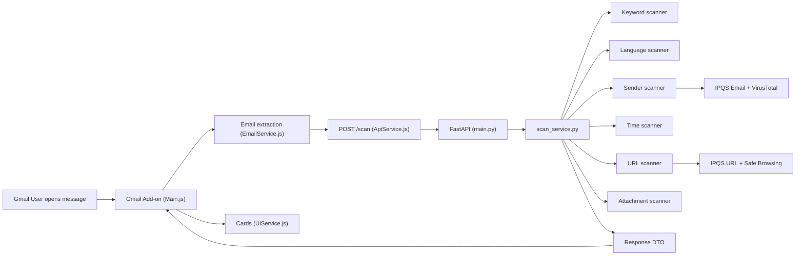

# PhishWall

PhishWall is a **Gmail add-on** (Google Apps Script) backed by a **FastAPI** service. It analyzes the open message, calls **`POST /scan`**, and—**in English, Spanish, or Hebrew**—presents a **Maliciousness Score** on **0–100** where **higher = more malicious** (as in the screenshots and `UiService.js`), together with **Verdict** (`Safe` / `Suspicious` / `Dangerous / Do Not Open`), **Risk Level** (aligned with the verdict band), reasoning, **Risk Indicators**, **Additional Context** (`infoFindings`), and **Score Breakdown**.

The JSON response includes both **`score`** (internal pipeline output: **100 − totalPenalty**, clamped) and **`maliciousScore`** (**100 − score**). Only **`maliciousScore`** is shown as the headline **“…/100”** in the summary card; **`score`** is available for integrations but is not what end users read as the main gauge.

---

## What it does

- Runs in Gmail on a selected message; extracts headers, body, URLs, and attachments (**including inline images**) via `EmailService.js`.
- Calls the backend **`/scan`** with that payload (`ApiService.js`).
- Renders **CardService** UI: prominent **Maliciousness Score**, **Verdict**, **Risk Level**, breakdown panels, localized tips—the language is chosen via the in-card switcher (see screenshots below).

---

## UI examples

<table align="center">
  <tr>
    <td align="center"><b>English</b></td>
    <td align="center"><b>Español</b></td>
    <td align="center"><b>Hebrew</b></td>
  </tr>
  <tr>
    <td></td>
    <td></td>
    <td></td>
  </tr>
</table>

---

## Threat focus (design rationale)

### Frequency, relevance, and priority (public reporting)

**Israel (2025).** In its [annual report](https://www.gov.il/en/pages/2025report), Israel’s **National Cyber Directorate** states that reported cyber incidents rose by about **55%** and that **phishing** remained the dominant vector, accounting for **52%** of reported cases.

**Global (Q1 2026).** Microsoft Threat Intelligence’s [email threat landscape — Q1 2026](https://www.microsoft.com/en-us/security/blog/2026/04/30/email-threat-landscape-q1-2026-trends-and-insights/) report frames **credential phishing** (including link-heavy delivery), **QR code phishing** (noting it as the fastest-growing vector that quarter, with volumes more than doubling), and prevalent **business email compromise (BEC)** as defining themes alongside ongoing payload experimentation.

**Synthesis.** Independent public reporting places **phishing** at the center of real-world incident mix (Israel) and defender telemetry (Microsoft), with **QR-assisted** flows and **BEC** attracting particular attention in Microsoft’s Q1 2026 analysis. That ordering motivated PhishWall’s feature set: **QR** decoding and linked-resource handling, **BEC/priority-threat** gates, **sender/brand impersonation** signals, plus **URL/attachment** hygiene and optional reputation—implemented as transparent **heuristics**, not as a substitute for full mail-security stacks.

PhishWall encodes those priorities in code:

| Theme | Implementation (high level) |
|--------|-----------------------------|
| **QR / quishing** | Decode QR from images (`contentBase64`); heuristically fetch and decode QR-linked URLs with strict limits (`scanners/qr_scanner.py`, `QrScannerAdapter` in `services/scanner_pipeline.py`). |
| **BEC / impersonation pressure** | Finance/urgency terms + sender/wording gates (`data/priority_threat_keywords.json`, `PriorityThreatScannerAdapter`). |
| **Spoofing & brands** | Look-alikes, display-name vs domain, punycode (`data/impersonation_targets.json`, `lookalike_domain_scanner.py`, `sender_scanner.py`). |
| **Traditional phishing vectors** | URL hygiene + optional reputation; attachment typing, PDF link extraction, executables/archives (`url_scanner.py`, `attachment_scanner.py`). |

---

## Architecture and scanner pipeline

**Client → server.** `Main.js` → `EmailService.js` → `ApiService.js` → `main.py` → `services/scan_service.py`.



The diagram simplifies the backend: **QR** runs inside the pipeline (`scanner_pipeline.py` → `qr_scanner.py`) but is omitted above for readability.

**Pipeline behavior.** Adapters in `services/scanner_pipeline.py` accumulate penalties and narratives; **`verdict_engine.py`** applies policy on top of the numeric result.

**Execution order:** keywords → language → sender → time → **QR** (attachments/inline images and QR-linked URLs) → priority threats (BEC) → link-density nudge → URL → attachments → totals → verdict.

---

## Design decisions and trade-offs

| Decision | Rationale |
|----------|-----------|
| **Rule-first core** | Predictable behavior and straightforward unit tests without mandatory third parties. |
| **Optional reputation** | IPQS (email/URL), VirusTotal (domain), Google Safe Browsing (URL fallback) deepen signals when keys exist; outages or missing keys still yield a complete scan. |
| **URL penalty dampening** | Only **`urlApplied = int(urlRaw × 0.7)`** enters **`totalPenalty`**, reducing single-link noise vs. spoofing or file-based risks. |
| **Verdict ≠ raw score rank** | `verdict_engine.py` combines **`maliciousScore`** with categorical “strong indicators” (executables, spoofing cues, flagged reputation, QR/BEC signals, urgent-keyword thresholds). |
| **Local backend + tunnel** | Default submission path: run FastAPI locally, expose with ngrok (or similar), point `gmail-addon/Config.js` at **`…/scan`**. Same **`/scan`** contract supports a hosted URL later—swap config and redeploy only. |

---

## Project structure

```text
phishwall_public_/
├── README.md
├── add_on_EN.png / add_on_es.png / add_on_img.png
├── run_dev.ps1 / run_dev.bat
├── .clasp.json               # Apps Script rootDir: gmail-addon
├── gmail-addon/              # Main, EmailService, ApiService, UiService, Config, appsscript.json
└── phishwall_backend/
    ├── main.py, models.py, requirements.txt
    ├── .env.example
    ├── data/                 # risk_keywords.txt, priority_threat_keywords.json, impersonation_targets.json
    ├── scanners/, services/, tests/
```

---

## Run locally

1. **Python deps:** `cd phishwall_backend` → `python -m pip install -r requirements.txt`
2. **Secrets:** copy **`phishwall_backend/.env.example`** → **`phishwall_backend/.env`**. Use `KEY=value` (no spaces around `=`). Optional: `IPQS_API_KEY`, `GOOGLE_SAFE_BROWSING_API_KEY`, `VT_API_KEY`.
3. **API:** from `phishwall_backend`:

   ```bash
   python -m uvicorn main:app --host 0.0.0.0 --port 8000
   ```

   Health: `http://localhost:8000/health`
4. **Public URL:** `ngrok http 8000` (or equivalent). Set **`gmail-addon/Config.js`** → `API_URL = "https://<host>/scan"`.
5. **Add-on:** from repo root, `clasp push` (Windows: `clasp.cmd push`). In Apps Script: **Deploy → Manage deployments**; refresh Gmail.

**Common issues:** port `8000` already bound (stop the conflicting process); ngrok **502** usually means nothing is listening on `localhost:8000`.

**API input:** Request body is validated with Pydantic; unknown fields are ignored (`ScanRequest.extra = "ignore"`).

---

## External services (optional)

| Service | Code | Role |
|---------|------|------|
| IPQS Email | `ipqs_email_client.py`, `sender_scanner.py` | Sender/email reputation enrichment |
| VirusTotal | `sender_scanner.py` | Domain reputation |
| IPQS URL | `url_scanner.py` | URL reputation |
| Google Safe Browsing | `url_scanner.py` | URL reputation fallback |

---

## Scoring and verdict

**Total penalty** (`scanner_pipeline.py`) sums: **`keywords`**, **`language`**, **`sender`**, **`time`**, **`qr`**, **`priorityThreats`**, **`linkBase`**, **`urlApplied`**, **`attachments`**. Then **`score = clamp(100 − totalPenalty)`** (`scan_service.py`). The response’s **`maliciousScore`** (**`100 − score`**) drives the **Maliciousness Score** line in Gmail. **`urlRaw`** is reported for transparency but **not** added into the total—only **`urlApplied`**.

**Relative weight (scan quickly):**

| Bucket | Role | Notes (code) |
|--------|------|----------------|
| Attachments | Largest single spikes | e.g. executable **`+60`**, disguised name **`+35`**, PDF-with-links **`+25`**, risky archive **`+12`** (`attachment_scanner.py`) |
| Sender | Strong structural signal | VT domain hits, display-name/brand mismatch, punycode; IPQS vs look-alike blend **`IPQS×0.7 + look-alike×0.6`** (`sender_scanner.py`) |
| URLs | High raw, softened in total | **`~70%`** of URL raw penalty applies (`UrlScannerAdapter`) |
| Keywords | Capped language pressure | **`risk_keywords.txt`**, escalation, cap **`40`** (`keyword_scanner.py`) |
| QR | Strong, bounded | Attachment branch capped **`36`**, linked-fetch branch **`42`**, then combined in **`qr`** (`qr_scanner.py`) |
| BEC / priority | Medium layer | **`+16`** multi-signal / **`+5`** weak single (`PriorityThreatScannerAdapter`) |
| Language / time / links | Light nudges | Language cap **`15`**; time **`≤2`** and only under BEC/ATO-like context (`time_scanner.py`); link-base cap **`3`** |

**Verdict** merges **`maliciousScore`** with policy rules in **`verdict_engine.py`**—not the breakdown table alone.

---

## Limitations

Heuristic rules and curated lists cannot cover every campaign; reputation APIs carry quotas and latency. Gmail **CardService** limits layout richness compared with a full web app.

---

## Tests

```bash
cd phishwall_backend
python -m unittest discover -s tests -v
```

---

## Submission checklist

**Include:** `README.md`; UI screenshots **`add_on_EN.png`**, **`add_on_es.png`**, **`add_on_img.png`**; **`gmail-addon/`**; **`phishwall_backend/`** (no secrets); helper scripts (`run_dev.*`); **`.gitignore`**.

**Exclude:** real `.env` files, `__pycache__/`, ephemeral logs.
