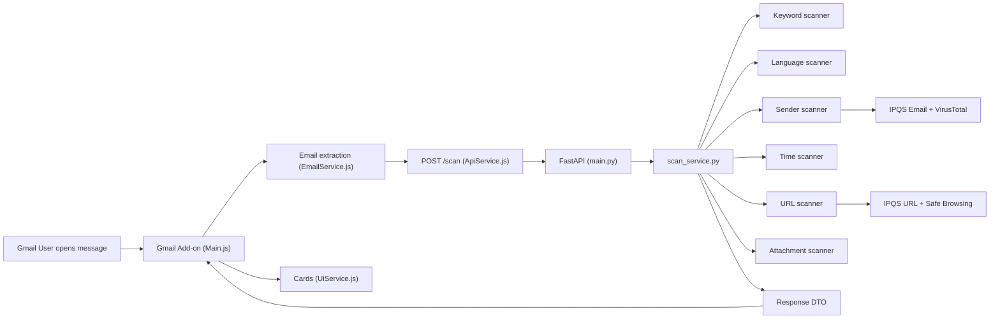

# PhishWall

PhishWall is a **Gmail add-on** (Google Apps Script) backed by a **FastAPI** service. It analyzes the open message, calls **`POST /scan`**, and—**in English, Spanish, or Hebrew**—presents a **Maliciousness Score** on **0–100** where **higher = more malicious** (as in the screenshots and `UiService.js`), together with **Verdict** (`Safe` / `Suspicious` / `Dangerous / Do Not Open`), **Risk Level** (aligned with the verdict band), reasoning, **Risk Indicators**, **Additional Context** (`infoFindings`), and **Score Breakdown**.

---

## What it does

- Runs in Gmail on a selected message; extracts headers, **`getPlainBody()`** text (**not full HTML MIME**), URLs inferred from plain text plus any list sent, and attachments (**including inline images** as attachments with Base64 payloads) via `EmailService.js`.
- Calls the backend **`/scan`** with that payload (`ApiService.js`).
- Renders **CardService** UI: prominent **Maliciousness Score**, **Verdict**, **Risk Level**, breakdown panels, localized tips—the language is chosen via the in-card switcher (see screenshots below).
- Before **`/scan`**, counts how many **threads from the same sender address** appear in the **current mailbox** (`GmailApp.search`, last **180 days**, first **50** hits) and sends **`sender_prior_thread_count`** for optional verdict calibration (see below). Nothing is written to a dedicated “trust database”; it is recomputed per scan from Gmail.

---

## UI examples

<table align="center">
  <tr>
    <td align="center"><b>English</b></td>
    <td align="center"><b>Español</b></td>
    <td align="center"><b>Hebrew</b></td>
  </tr>
  <tr>
    <td></td>
    <td></td>
    <td></td>
  </tr>
</table>

---
## Threat focus (design rationale)

I reviewed recent public reporting to decide what PhishWall should emphasize. The main pattern was clear: phishing remains central, especially QR-based attacks, BEC-style pressure, impersonation, suspicious URLs, and dangerous attachments.

Sources: [Israel National Cyber Directorate annual report](https://www.gov.il/en/pages/2025report), [Microsoft Threat Intelligence – Email threat landscape Q1 2026](https://www.microsoft.com/en-us/security/blog/2026/04/30/email-threat-landscape-q1-2026-trends-and-insights/).

Scoring is additive and rule-based: penalties are recorded in **`scoreBreakdown`**, but **`totalPenalty`** (and therefore **`maliciousScore`**) uses only a fixed subset of keys—see [Scoring and verdict](#scoring-and-verdict). In particular, **`urlRaw`** is kept for transparency while **`urlApplied`** is what enters **`totalPenalty`**. Larger **`totalPenalty`** lowers **`score`** and raises **`maliciousScore`**. **`Verdict`** is computed separately in **`verdict_engine.py`** alongside those numbers and scanner summaries.

| Threat category | What is checked | Score impact | Implemented in |
|---|---|---|---|
| **QR / “quishing”** | QR payloads in images, QR-like links, limited linked-content decode | Adds **`qr`**. Important but capped, so repeated QR paths do not over-inflate the score. | `qr_scanner.py`, `QrScannerAdapter` |
| **BEC / priority framing** | Finance/urgency **phrases in subject/sender/body** (per `priority_threat_keywords.json`), plus optional keyword+finance coupling or sender-based impersonation hints from earlier pipeline outputs | Adds **`priorityThreats`**. Moderate impact. “Pressure” no longer comes from generic keyword score alone without finance/lexical cues (reduces benign personal/study false positives). | `priority_threat_keywords.json`, `PriorityThreatScannerAdapter` |
| **Sender & brand trust** | Display-name/domain mismatch, punycode, look-alikes on the **sender** domain/message context, optional IPQS/VirusTotal | Adds **`sender`**. Can become one of the heavier contributors when spoofing or reputation alerts stack. Same look-alike helper also runs inside **`url_scanner.py`** for **link hosts**—those penalties accrue under **`urlRaw`** / **`urlApplied`**, not **`sender`**. | `sender_scanner.py`, `lookalike_domain_scanner.py`, `data/impersonation_targets.json` |
| **Links & URL reputation** | Suspicious URL structure, TLD hints, malformed patterns, optional URL reputation | Uses **`urlRaw`** / **`urlApplied`**. Only the dampened URL penalty enters the final sum. | `url_scanner.py` |
| **Attachments & payloads** | Executables, disguised filenames, risky archives, PDFs with extracted links | Adds **`attachments`**. Often one of the strongest contributors. | `attachment_scanner.py` |
| **Keywords & language** | Phishing lexicon, escalation patterns, low-quality text heuristics | Adds **`keywords`** and **`language`**. Supporting to medium impact, with caps. | `keyword_scanner.py`, `language_scanner.py` |
| **Context nudges** | Unusual send time when combined body text matches built-in BEC/ATO keyword lists; **`linkBase`** penalty starting from **the first URL** with small increments as link count rises (capped) | Adds **`time`** and **`linkBase`**. Small supporting penalties only. | `time_scanner.py`, `LinkBaseScannerAdapter` |

**Takeaway:** PhishWall does not use a hidden weighting model. The score comes from fixed rule weights, caps, dampening, and separate verdict rules already defined in code.

---


## Architecture and scanner pipeline

The figure below is a **high-level, end-to-end view** of how a message moves from the user through the add-on and backend to the scored Card UI. It complements the ordered flowchart that follows (which drills into scanner stages and optional reputation calls).

<table align="center">
  <tr>
    <td align="center">
      
    </td>
  </tr>
</table>

**Client → server.** `Main.js` → `EmailService.js` → `ApiService.js` → `main.py` → `services/scan_service.py`.



The Mermaid diagram simplifies the backend: **QR** runs inside the pipeline (`scanner_pipeline.py` → `qr_scanner.py`) but is omitted above for readability.

**Pipeline behavior.** Adapters in `services/scanner_pipeline.py` accumulate penalties and narratives; **`verdict_engine.py`** applies policy on top of the numeric result.

**Execution order:** keywords → language → sender → time → **QR** (attachments/inline images and QR-linked URLs) → priority threats (BEC) → link-density nudge → URL → attachments → totals → verdict.

---

## Design decisions and trade-offs

| Decision | Why |
|----------|-----|
| **Modular scanner pipeline** | Each heuristic is a small **adapter** that conforms to a `Scanner` **Protocol** in `scanners/base.py` (shared `ScanContext` in, `ScannerResult` out; `applies` / `run`). A central `ScannerPipeline` in `scanner_pipeline.py` runs the ordered list. This is **structural typing** (like programming-to-an interface), not a single **ABC** hierarchy with `@abstractmethod`—any class with the right methods can plug in. |
| **Rule-first core** | PhishWall is built around transparent rules first, so its behavior is easier to understand, test, and debug without depending on external services. |
| **Optional reputation** | External reputation checks such as IPQS, VirusTotal, and Google Safe Browsing strengthen the scan when API keys are available, but the system still works even if those services are unavailable. |
| **URL penalty dampening** | URL findings are intentionally reduced before they affect the final score, so one suspicious-looking link does not outweigh stronger signals such as spoofing or dangerous attachments. |
| **Verdict is not based on score alone** | The final verdict is not decided by the numeric score alone. It also takes into account stronger warning signs such as executables, spoofing cues, reputation alerts, QR/BEC-related signals, and urgency patterns. |
| **Local backend + tunnel** | The default setup runs the FastAPI backend locally and exposes it through ngrok (or a similar tunnel). The same `/scan` endpoint can later point to a hosted server with only a small config change. |
| **Mailbox familiarity is moderation only** | The add-on sends a **fresh thread-count estimate** per request (Gmail search, not stored server-side); the backend may **raise Dangerous thresholds** when the count is **≥ 5** and there are **no** override signals (**executable**, **disguised filenames**, **risky archives**, **`vtFlagged`/`ipqsFlagged` on sender**, **IPQS/GSB-flagged URLs**, **QR decode / QR-url-payload indicators**—see `verdict_engine.py`). **Not** a whitelist; penalties are unchanged—only verdict cutoffs shift when moderation applies. |
| **BEC gating** | Full multi-signal BEC needs explicit finance/urgency language (or keyword+finance coupling), not keyword score alone as a pressure substitute. |

---

## Project structure

```text
phishwall_public_/
├── README.md
├── system_img.png
├── add_on_EN.png / add_on_es.png / add_on_img.png
├── run_dev.ps1 / run_dev.bat
├── .clasp.json               # Apps Script rootDir: gmail-addon
├── gmail-addon/              # Main, EmailService, ApiService, UiService, Config, appsscript.json
└── phishwall_backend/
    ├── main.py, models.py, requirements.txt
    ├── .env.example
    ├── data/                 # risk_keywords.txt, priority_threat_keywords.json, impersonation_targets.json
    ├── scanners/, services/, tests/
```

---

## Run locally

1. **Python deps:** `cd phishwall_backend` → `python -m pip install -r requirements.txt`
2. **Secrets:** copy **`phishwall_backend/.env.example`** → **`phishwall_backend/.env`**. Use `KEY=value` (no spaces around `=`). Optional: `IPQS_API_KEY`, `GOOGLE_SAFE_BROWSING_API_KEY`, `VT_API_KEY`.
3. **API:** from `phishwall_backend`:

   ```bash
   python -m uvicorn main:app --host 0.0.0.0 --port 8000
   ```

   Health: `http://localhost:8000/health`
4. **Public URL:** `ngrok http 8000` (or equivalent). Edit **`gmail-addon/Config.js`**: replace the **`API_URL`** placeholder **`https://YOUR_PUBLIC_HOST_HERE/scan`** with your real **`https://<host>/scan`** (do **not** commit personal tunnel URLs when publishing).
5. **Add-on:** from repo root, `clasp push` (Windows: `clasp.cmd push`). In Apps Script: **Deploy → Manage deployments**; refresh Gmail.

**Common issues:** port `8000` already bound (stop the conflicting process); ngrok **502** usually means nothing is listening on `localhost:8000`.

**API input:** Request body is validated with Pydantic; unknown fields are ignored (`ScanRequest.extra = "ignore"`). Optional integer **`sender_prior_thread_count`** (**0–200**): when using the bundled add-on this is filled automatically; bare API clients may omit it (**0**).

**Note:** `run_dev.ps1` / `run_dev.bat` (if present) are optional developer helpers and may hardcode local paths—review before running, or use the manual steps above.

---

## External services (optional)

| Service | Code | Role |
|---------|------|------|
| IPQS Email | `ipqs_email_client.py`, `sender_scanner.py` | Sender/email reputation enrichment |
| VirusTotal | `sender_scanner.py` | Domain reputation |
| IPQS URL | `url_scanner.py` | URL reputation |
| Google Safe Browsing | `url_scanner.py` | URL reputation fallback |

---

## Scoring and verdict

**Total penalty** (`scanner_pipeline.py`) sums: **`keywords`**, **`language`**, **`sender`**, **`time`**, **`qr`**, **`priorityThreats`**, **`linkBase`**, **`urlApplied`**, **`attachments`**. Then **`score = clamp(100 − totalPenalty)`** (`scan_service.py`). The response’s **`maliciousScore`** (**`100 − score`**) drives the **Maliciousness Score** line in Gmail; **`score`** is also returned for tooling. **`urlRaw`** is reported for transparency but **not** added into the total— **`urlApplied = int(urlRaw × 0.7)`** (truncate toward zero) is what **`totalPenalty`** uses.

**Relative weight (scan quickly):**

| Bucket | Role | Notes (code) |
|--------|------|----------------|
| Attachments | Largest single spikes | e.g. executable **`+60`**, disguised name **`+35`**, PDF-with-links **`+25`**, risky archive **`+12`** (`attachment_scanner.py`) |
| Sender | Strong structural signal | VT domain hits, display-name/brand mismatch, punycode; IPQS vs look-alike blend **`IPQS×0.7 + look-alike×0.6`** on **sender-associated** lookups (`sender_scanner.py`). Look-alike-style checks on **link hosts** are scored separately inside **`urlRaw`/`urlApplied`** (`url_scanner.py`). |
| URLs | High raw, softened in total | **`~70%`** of URL raw penalty applies (`UrlScannerAdapter`) |
| Keywords | Capped language pressure | **`risk_keywords.txt`**, escalation, cap **`40`** (`keyword_scanner.py`) |
| QR | Strong, bounded | Attachment branch capped **`36`**, linked-fetch branch **`42`**, then combined in **`qr`** (`qr_scanner.py`) |
| BEC / priority | Medium layer | **`+16`** multi-signal / **`+5`** weak single (`PriorityThreatScannerAdapter`) |
| Language / time / links | Light nudges | Language cap **`15`**; time **`≤2`** and only under BEC/ATO-like context (`time_scanner.py`); link-base cap **`3`** |

**Verdict** merges **`maliciousScore`**, categorical **strong indicators** derived from summaries + **`riskIndicators`** text (executable, spoofing substrings, URL heuristics, reputation flags, BEC, QR, keyword pressure…), and **two Dangerous threshold tables** (`verdict_engine.py`): **default** vs **`familiar_mod`** when mailbox history + gates pass—not the spreadsheet alone.

**Mailbox familiarity calibration (current release).** Not persistent per-user storage and **not** a whitelist. The Gmail add-on passes **`sender_prior_thread_count`** from a **live `GmailApp.search`** (same sender, **≤50** threads, **180 days**—see `EmailService.js`). When **`≥ 5`** and **no** override signals fire (same list as Design table row: exe/disguised/archive/reputation sender+URL/decoded QR path…), Dangerous cuts are **raised**; **`familiarSenderCalibration: true`** on **Suspicious** selects softer copy in **`UiService.js`**. **BEC tight gating** (lexical finance/pressure or keyword+finance coupling; see **`PriorityThreatScannerAdapter`**) further reduces personal/study false positives paired with benign PDF/DOC stacks.

---

## Limitations

Heuristic rules and curated lists cannot cover every campaign; reputation APIs carry quotas and latency. Gmail **CardService** limits layout richness compared with a full web app. **`GmailApp.search`** is subject to Apps Script quotas/latency.

**Future (not implemented here):** A multi-tenant product might persist a **per-user sender trust / interaction model** (e.g. stored interaction counts, decay, explicit user overrides) in application data—**separate** from this prototype’s stateless `POST /scan` + ephemeral mailbox query. That would live between the client and API (e.g. user profile service or encrypted user store), not inside the current heuristic pipeline.

---

## Tests

```bash
cd phishwall_backend
python -m unittest discover -s tests -v
```

---

## Submission checklist

**Include:** `README.md`; **`system_img.png`** (high-level end-to-end architecture / flow); UI screenshots **`add_on_EN.png`**, **`add_on_es.png`**, **`add_on_img.png`**; **`gmail-addon/`**; **`phishwall_backend/`** (no secrets); helper scripts (`run_dev.*`); **`.gitignore`**. Optionally **`.clasp.json`** only if acceptable for reviewers to attach to an existing Apps Script project (otherwise document `clasp create` + `scriptId`).

**Exclude:** **`phishwall_backend/.env`**, **`gmail-addon/Config.js`** values that expose private tunnel URLs **if** you redeploy placeholders for the repo, **`__pycache__/`**, noisy logs.

**Smoke test before submit:** `GET /health` → `{"status":"ok"}`; **`python -m unittest discover -s tests -v`** from **`phishwall_backend/`**.
