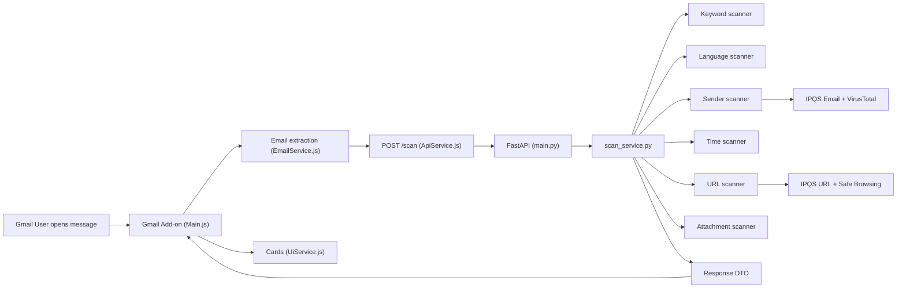

# PhishWall

Gmail Add-on + FastAPI backend that scores email safety (`0..100`) with verdicts (`Safe`, `Suspicious`, `Dangerous / Do Not Open`) and structured findings (`riskIndicators`, `infoFindings`, `scoreBreakdown`). Combines phishing-adjacent signals: spoofing, suspicious URLs/attachments, QR, and BEC-style patterns.

---

## What It Does

- Opens on a message → extracts fields + URLs + attachments (including **inline images**) → `POST /scan`.
- Returns score, verdict, reasoning, recommendation, and scanner summaries. Local heuristics always run; external reputation is optional (see below).

---

## Architecture



QR runs inside the pipeline (`scanner_pipeline.py` → `qr_scanner.py`); the diagram omits QR for clarity — see **Scanner pipeline** below. Static figure: repo root **`img.png`**.

---

## Scanner pipeline (implemented)

**Pattern:** Pipeline adapters + central aggregation; `verdict_engine.py` maps score + strong indicators to verdict.

**Key files:** `scanners/base.py`, `services/scanner_pipeline.py`, `scanners/qr_scanner.py`, `services/verdict_engine.py`, `services/scan_service.py`.

**Order:** keywords → language → sender → time → **QR** (attachments/inline + QR-linked URLs) → priority threats (BEC) → link base → URL → attachments → aggregate → verdict.

**QR (brief):** Decode from image bytes (`contentBase64`). Optionally treat URLs as QR-related (heuristic → fetch up to a small limit → decode). Penalties and findings land in `scoreBreakdown.qr`, `qrSummary`, and `riskIndicators`; verdict policy treats decoded QR URLs as stronger signals.

---

## Project structure

```text
phishwall_public_/
├── README.md
├── .env.example
├── run_dev.ps1 / run_dev.bat
├── .clasp.json (Apps Script: rootDir gmail-addon)
├── gmail-addon/   (Main, EmailService, ApiService, UiService, Config, appsscript.json)
└── phishwall_backend/
    ├── main.py, models.py, requirements.txt
    ├── data/ (risk_keywords, priority_threat_keywords, impersonation_targets)
    ├── scanners/, services/, tests/
```

---

## Run locally

1. **Deps:** `cd phishwall_backend` → `python -m pip install -r requirements.txt`

2. **Env:** Copy `phishwall_backend/.env.example` to `phishwall_backend/.env`. Format `KEY=value` (no spaces around `=`). Keys: `IPQS_API_KEY`, `GOOGLE_SAFE_BROWSING_API_KEY`, `VT_API_KEY` — all optional; without them, local scans still work.

3. **Backend:** From `phishwall_backend`:  
   `python -m uvicorn main:app --host 0.0.0.0 --port 8000`  
   Check `http://localhost:8000/health`.

4. **Ngrok:** `ngrok http 8000` — set `gmail-addon/Config.js` → `API_URL = "https://<your-ngrok-host>/scan"`.

5. **Add-on:** Repo root: `clasp.cmd push` (Windows) or `clasp push`; **Deploy → Manage deployments** in Apps Script; refresh Gmail.

**Windows quick fixes:** Port in use (`10048`) → find listener on 8000 and `Stop-Process`. Ngrok **502** → backend not up on localhost:8000.

---

## Design choices (technical)

- **Rule-based core:** Deterministic, testable behavior without external APIs.
- **External APIs as enrichment:** IPQS Email (`ipqs_email_client.py` / `sender_scanner.py`), VirusTotal domain (`sender_scanner.py`), IPQS URL + Google Safe Browsing fallback (`url_scanner.py`). Missing keys or provider failures → local-only path still returns a full response.
- **Local + ngrok:** Fast iterate/demo loop; can swap later for a hosted backend (update `Config.js` + env on host only).

---

## Threat focus & data

Prioritizes **QR-related abuse** and **BEC/impersonation** (urgency, finance language, brand mismatch). BEC terms: `data/priority_threat_keywords.json`. Brands/look-alikes: `data/impersonation_targets.json` + `lookalike_domain_scanner.py` (normalized matching, typo-style variants).

---

## Coverage (summary)

**Sender / URL / attachments:** Look-alikes, display-name vs domain, URL hygiene (shorteners, punycode, etc.), executables/archives/disguised names, PDF link heuristics, optional reputation as above.

**Input:** Pydantic limits, extra fields ignored, generic 500 body.

---

## Scoring & verdict

Orchestration in `scan_service.py`: start 100, subtract penalties, scale URL applied (`urlApplied = int(urlRaw * 0.7)`), clamp, `maliciousScore = 100 - score`. Verdict in `verdict_engine.py` uses **score + strong indicators** (executables, spoofing, bad links/reputation, urgent keywords, decoded QR, BEC, etc.) — not score alone.

---

## External services (reference)

| Service | Where | Notes |
|---|---|---|
| IPQS Email | `sender_scanner`, `ipqs_email_client` | Optional |
| VirusTotal domain | `sender_scanner` | Optional |
| IPQS URL | `url_scanner` | Optional |
| Google Safe Browsing | `url_scanner` | Fallback for URL rep |

---

## Hosted backend (later)

Deploy `phishwall_backend` with e.g. `uvicorn main:app --host 0.0.0.0 --port $PORT`, set the same env vars, point `Config.js` to `https://<host>/scan`, redeploy the add-on. No architecture change required; consider rate limits, monitoring, and key rotation for production.

---

## Tests

```bash
cd phishwall_backend
python -m unittest discover -s tests -v
```

---

## Limitations

Heuristic scoring and finite brand lists; reputation depends on quotas; CardService UI limits expressiveness.

---

## Submission

**Include:** `README.md`, `img.png`, `gmail-addon/*`, `phishwall_backend/*` (no secrets), run scripts, `.gitignore`.  
**Exclude:** real `.env`, `__pycache__`, noisy logs.
