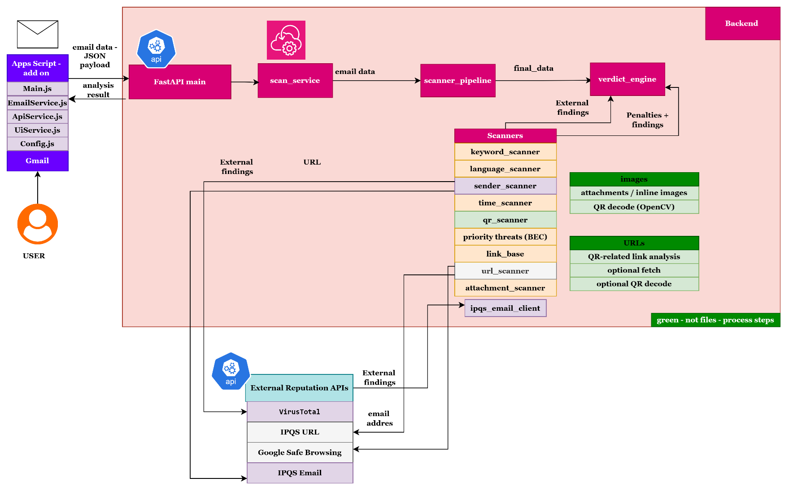
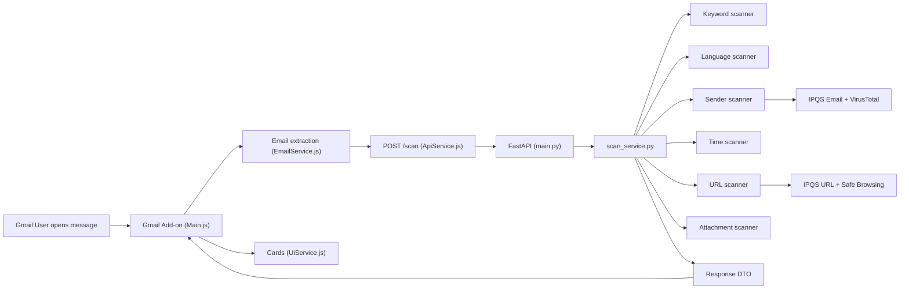

# Architecture and scanner pipeline

**See also:** documentation hub **[README.md](README.md)** · Gmail client detail **[gmail-addon.md](gmail-addon.md)**.

High-level flow: Gmail user selects a message → add-on extracts a JSON payload → **`POST /scan`** (`phishwall_backend`) → **`ScanResponse`** drives cards in **`UiService.js`**.

**Client → server:** `Main.js` → **`EmailService.js`** → **`ApiService.js`** → **`main.py`** → **`services/scan_service.py`** (`analyze_email`) → **`services/scanner_pipeline.py`** (+ **`services/verdict_engine.py`**).

**Local run checklist (two terminals, correct `cd`, ngrok HTTPS, `API_URL`):** **[getting-started.md — Running from scratch](getting-started.md#running-from-scratch-step-by-step)**.

---

## System diagram

---

## Simplified backend flow (Mermaid)

The diagram is illustrative: some stages run **in parallel within dependency phases** (see below). **QR** is inside the pipeline but omitted here for readability.

---

## Pipeline behaviour

Adapters conform to **`Scanner`** in **`scanners/base.py`**: **`ScanContext`** in, **`ScannerResult`** out (`applies` / `run`). **`ScannerPipeline`** (`services/scanner_pipeline.py`) accumulates **`breakdown`** buckets, **`riskIndicators`**, **`infoFindings`**, and scanner **summaries**. **`verdict_engine.build_verdict`** applies policy **on top** of the numeric outcome (see **[Scoring & verdict](scoring-and-verdict.md)**).

### Logical dependency order (parallelism inside phases)

1. **Phase 1:** `keywords`, `language`, `sender`, `time` — may run concurrently when **`applies`** is true for each (independent reads of **`ScanContext`** only).
2. **Phase 2:** **`priority_threats` (BEC)** — runs **after** phase 1; it reads keyword breakdown and sender raw metadata from shared state.
3. **Phase 3:** **`qr`**, **`link_base`**, **`url`**, **`attachments`** — may run concurrently; each consumes **`ScanContext`** and merged state shapes only where needed.

Within **QR**, attachment decoding and QR-linked URL work can overlap (see **`QrScannerAdapter`** and **`qr_scanner.py`**).

Optional outbound calls use **bounded HTTP timeouts** (`scanners/external_http_config.py`, tunable via **`PHISHWALL_*`** — see **`phishwall_backend/.env.example`**). Failures fall back to local heuristics without changing the **`POST /scan`** schema.

For **wall time, per-service timeouts, and behavior when a stage errors**, see **[latency-and-resilience.md](latency-and-resilience.md)**.

For **how numbers become score and verdict**, use **[scoring-and-verdict.md](scoring-and-verdict.md)**.
